
<h1 align="center">校园失物招领网站的研发+jsp</h1>

## 简介
校园失物招领网站：角色分为管理员、用户；功能包括失物招领管理、物品挂失管理、公告管理、用户信息管理、失物认领和后台管理。    --计算机毕业设计源码；毕设源码；java毕业设计源码

## 联系方式

<h3 align="center">获取完整代码与数据库文件 + 微信：deepguan QQ: 86050149 QQ群: 783742310</h3>

<h3 align="center">可帮忙远程部署 包运行成功！提供远程部署、修改代码、设计文档指导、代码讲解等服务！</h3>

## 功能介绍（完整见运行截图）
管理员：管理员拥有登录和注销功能，在管理页面可以浏览失物列表，包括物品详情如编号、名称、类别、拾取时间和地点等信息；有权管理用户信息，发布公告和查看留言版互动；还可进行失物认领审核、光荣榜发布、物品挂失管理，并能在需要时切换到后台管理以执行高级管理操作。

用户：用户可以通过登录界面输入凭证进行登录，进入系统后能够浏览失物招领信息，包括查看物品详情、评论互动、提交认领请求等功能；他们可以发布物品挂失信息，填写详细信息和上传图片；在个人中心，用户可以查看个人信息、管理已发布的认领和挂失记录，并参与互动评论与论坛讨论。

访客：访问者可以浏览网站主页，通过导航栏访问首页、论坛、光荣榜等模块，了解校园公告和最新失物招领动态；他们可以在没有登录的情况下查看物品信息和基本公告，但无法进行认领或发布挂失信息操作；访客可以利用搜索功能简单查询失物信息以获取需求信息。

开发者：开发者使用本地服务器环境进行开发测试，包括设计与实现前后台交互功能、确保用户数据安全和存取权限、优化搜索与筛选算法；负责网页UI设计与功能按钮实现，保证各项功能模块的运行流畅，同时开发维护后台数据管理系统以支持项目整体性能。

## 运行截图
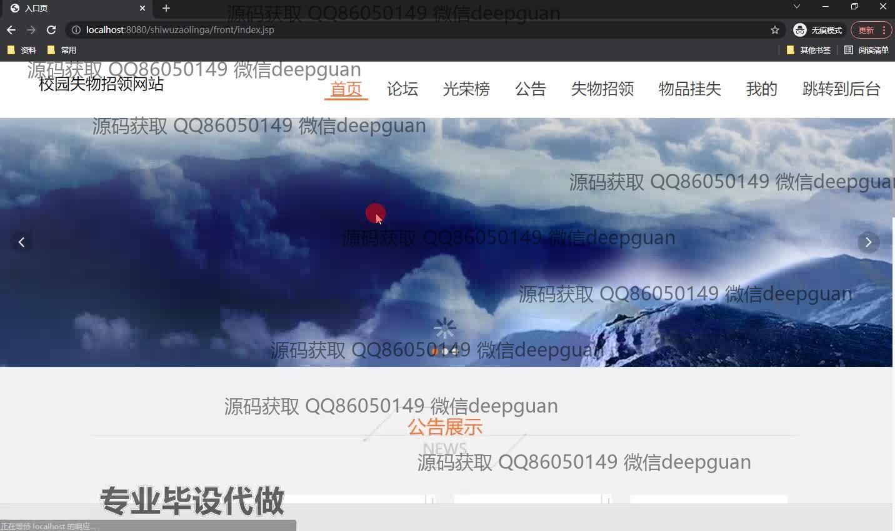
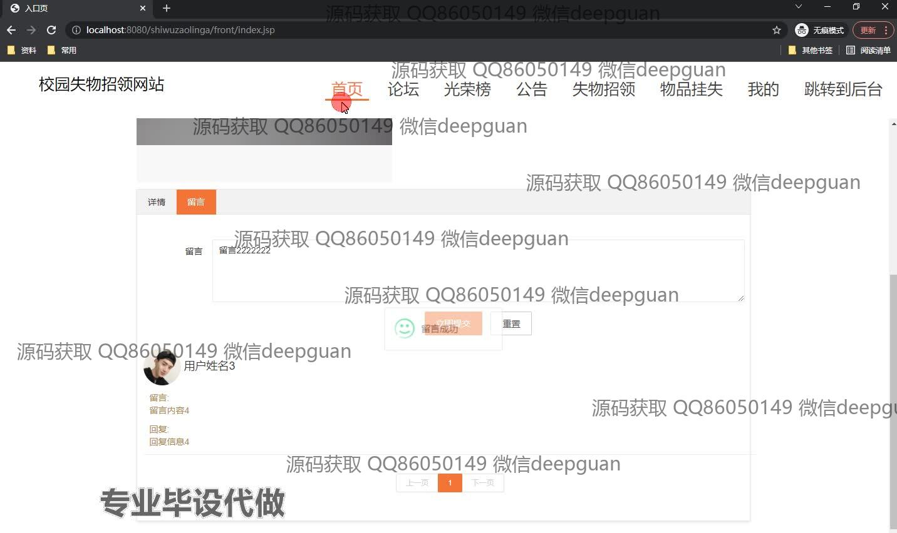
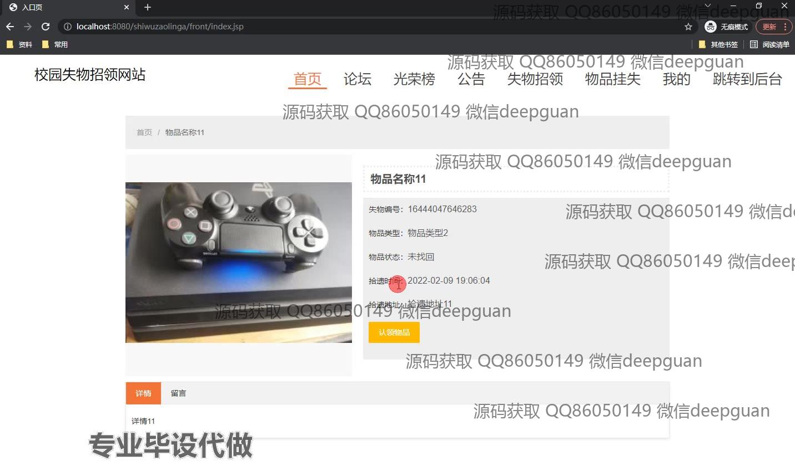
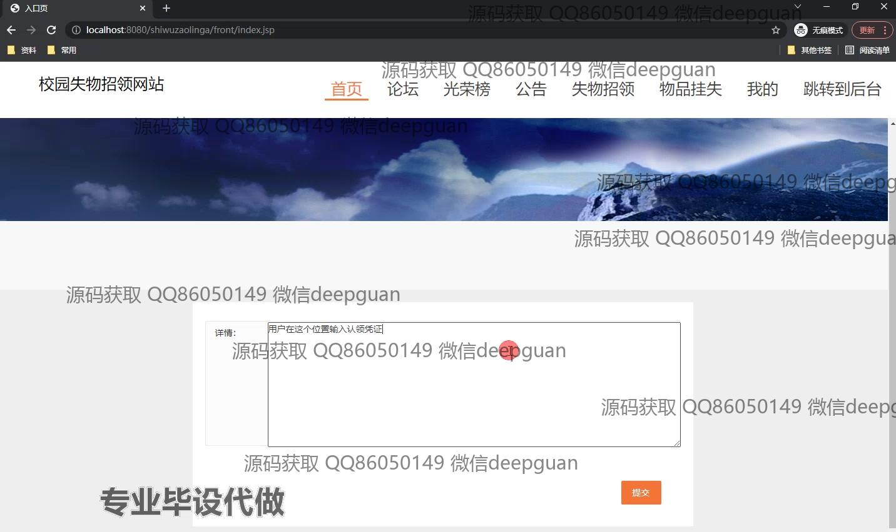
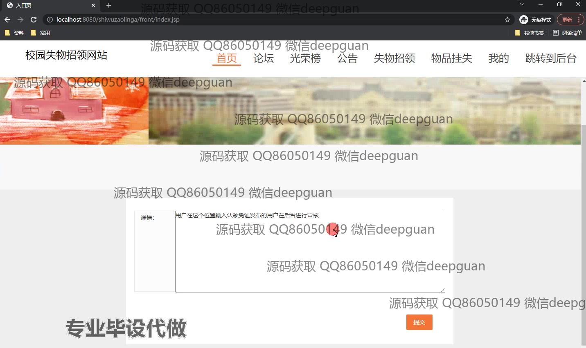
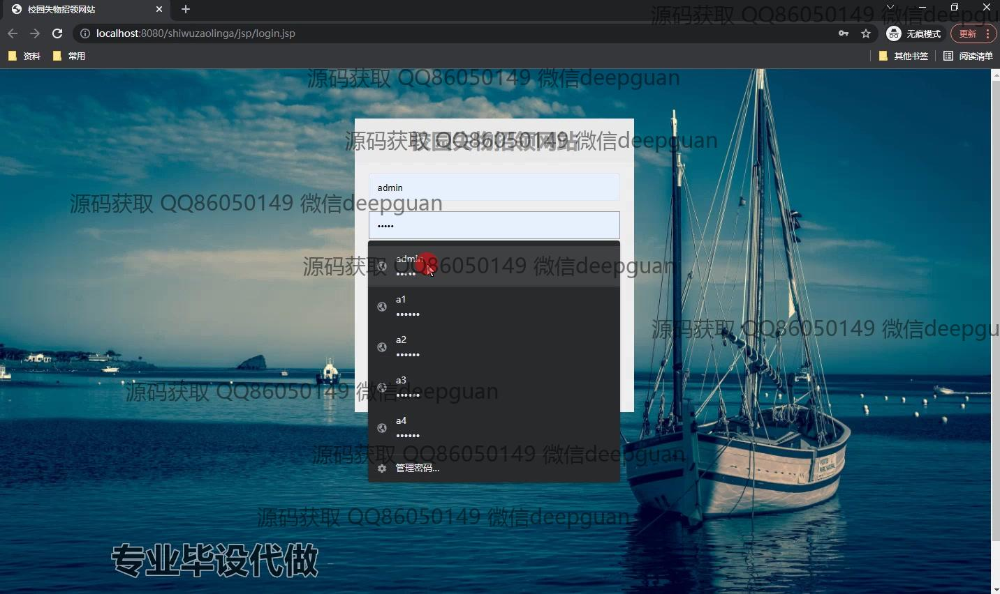
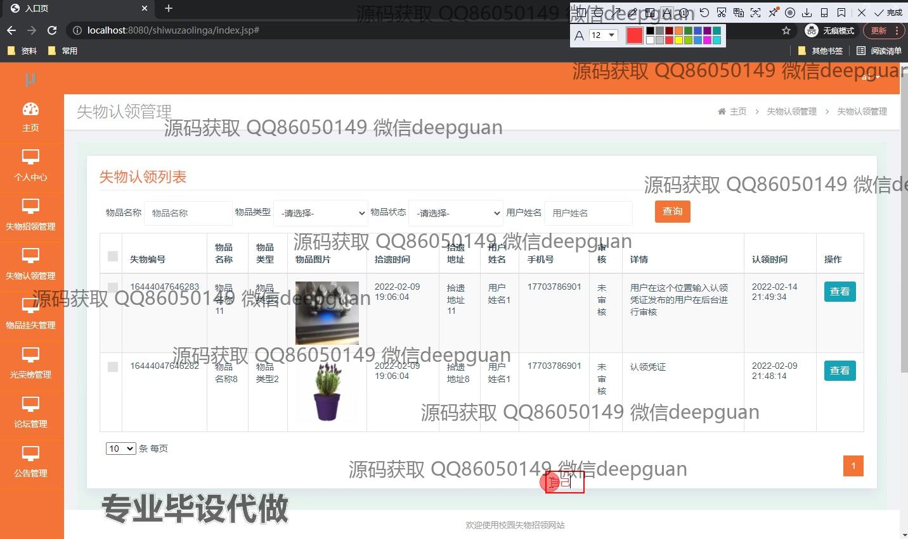
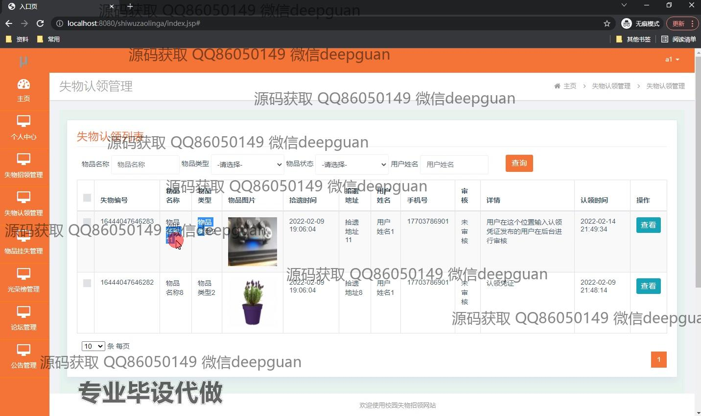
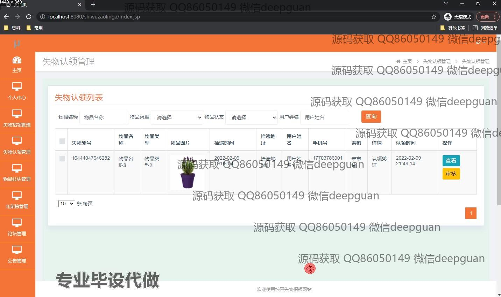
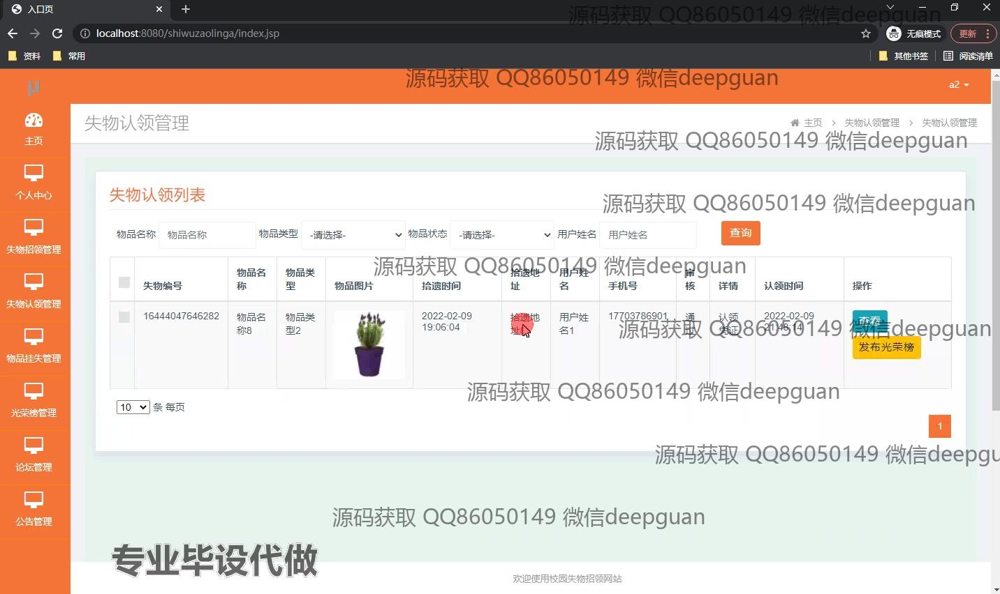
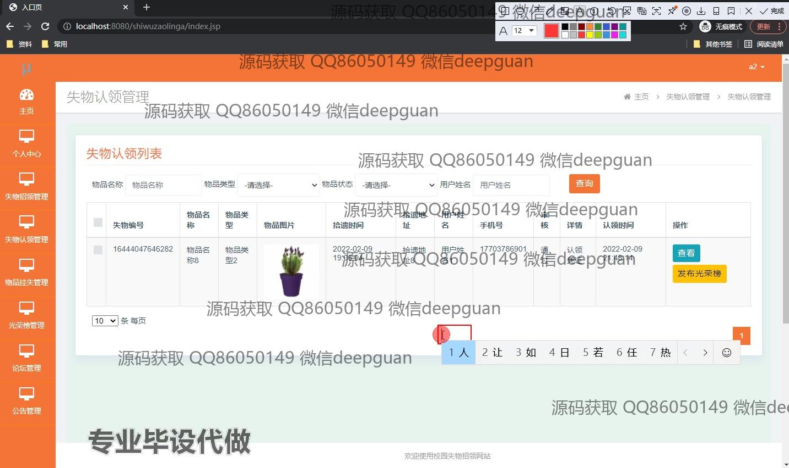
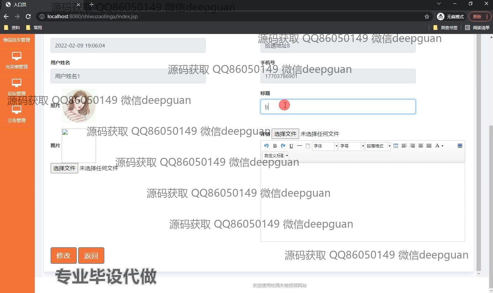
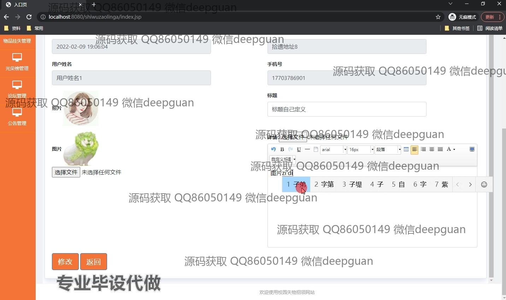
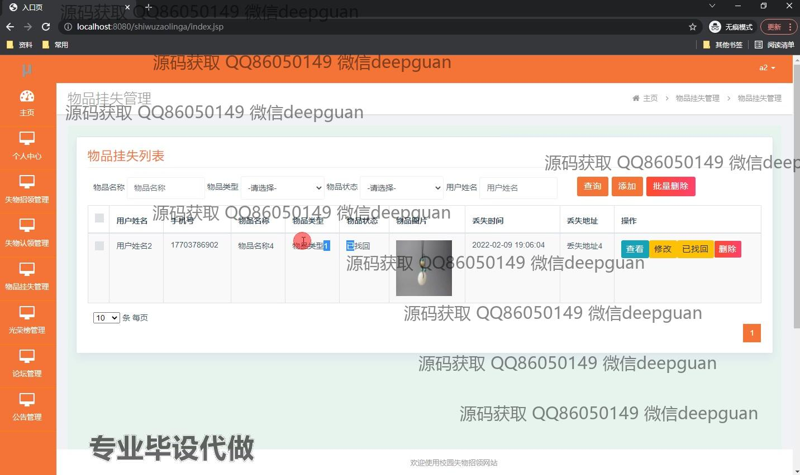

本代码来源于网络,仅供学习参考使用!

